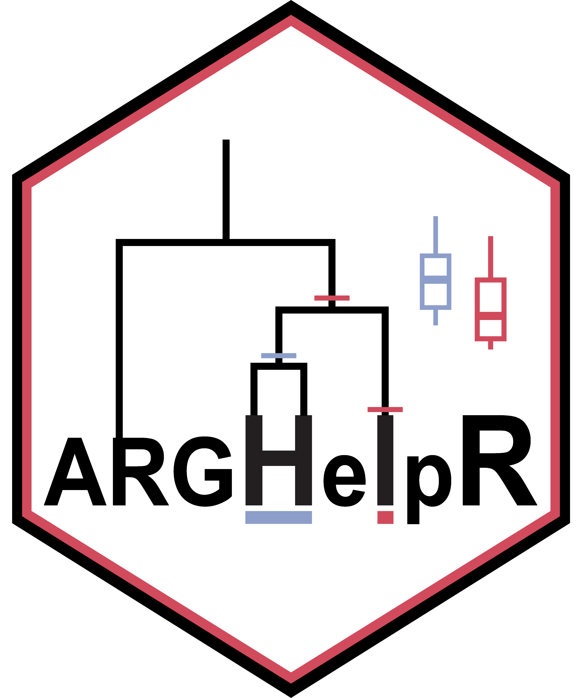

<!-- README.md is generated from README.Rmd. Please edit that file -->

```{r, include = FALSE}
knitr::opts_chunk$set(
  collapse = TRUE,
  comment = "#>",
  fig.path = "man/figures/README-",
  out.width = "100%"
)
```

# ARGHelpR version 1.0.0 

<!-- badges: start -->
[](https://cran.r-project.org/package=ARGHelpR)
[](https://cran.r-project.org/package=ARGHelpR)
[](https://opensource.org/licenses/GPL-3.0)
[](https://github.com/kfarleigh/ARGHelpR/actions/workflows/R-CMD-check.yaml)
<!-- badges: end -->

## What is *ARGHelpR*?
*ARGHelpR* is an R package that summarizes and visualizes output from ancestral recombination graphs (ARGs). This allows researchers to identify specific regions of the genome that may be influenced by some form of selection and those that may be involved in specific processes such as introgression. Please see our [vignette](https://kfarleigh.github.io/placeholder) and [tutorials](https://kfarleigh.github.io/placeholder) using the articles dropdown tag to see how you can identify these regions in your own data and how you can convert your output from different ARG programs into the format needed to use *ARGHelpR*. 


We plan to continue developing the package to include more functions, feel free to reach out to Keaka Farleigh if you have any suggestions or would like to collaborate. 

## Installation

You can install the development version of ARGHelpR from [GitHub](https://github.com/) with:

``` r
# install.packages("pak")
pak::pak("kfarleigh/ARGHelpR")
```

## Citing *ARGHelpR*
