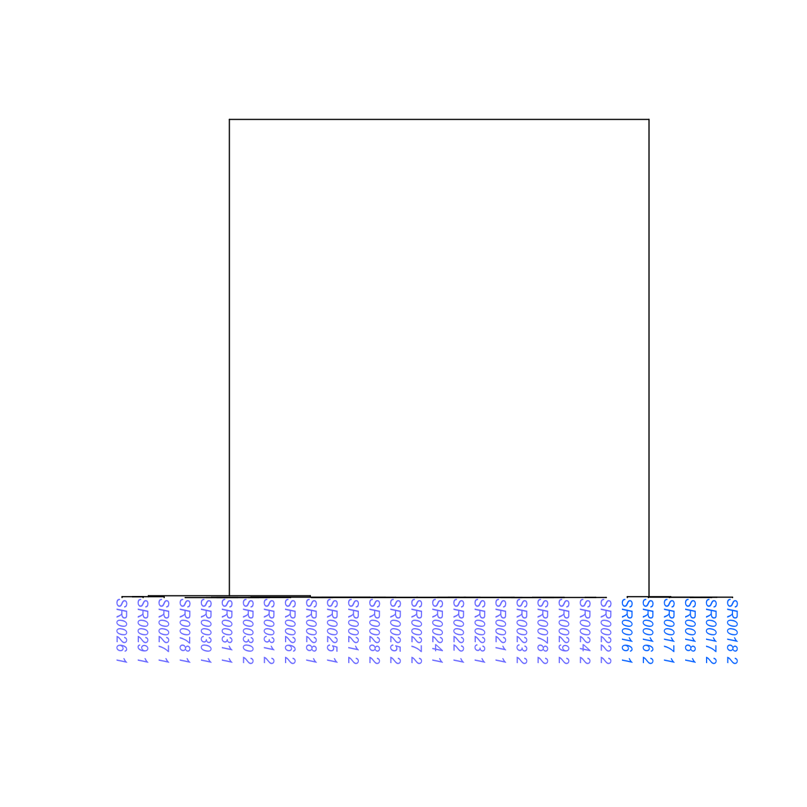

# arghelpr-vignette

Written by: Keaka Farleigh, Ph.D.  
Date: September, 22nd, 2026.  
Date last modified: September, 22nd, 2026

## Purpose

To show you how to use ARGHelpR to summarize ancestral recombination
graphs (ARGs), identify ARGs that may be indicative of selection
influencing a particular region, identify ARGs that may shown signs of
introgression, and visualize these results.

**Note we infer ARGs that represent regions influenced by selection and
those that represent introgressed regions. This is only for the purposes
of showing you how ARGHelpR works. You must understand you study system
and determien which of these analyses are appropriate. For example, is
there support for introgression or divergence? Please email Keaka
Farleigh if you have any questions**.

Please see the [What’s an ARG
article](https://kfarleigh.github.io/ARGHelpR/articles/ARGHelpR_arg_background.html)
if you would like some background on ARGs.

This vignette will proceed in five steps:

1.  Inspect data and prepare it for analysis
2.  Calculate ARG statistics
3.  Identify divergence candidates
4.  Identify introgression and balancing selection candidates
5.  Visualize ARGs

### 1. Inspect data

ARGHelpR expects data to be a list where each element is a data frame
containing information for a particular ARG; the first column is named
chromosome and indicates the chromosome, the second column is named
start indicates the start position of an ARG, the third position is
named end indicates the end position of the ARG, and the fourth column
is named tree and indicates the ARG itself. This is best represented as
a bed file. You can find example scripts to convert your ARG output to a
bed file in the format expected by ARGHelpR in the [formatting data
article](https://kfarleigh.github.io/ARGHelpR/articles/ARGHelpR_formatting.html).

After we have a bed file, we can read it into R.

``` r


# Assuming a bed file with columns named chromosome, start, end, and tree
data <- read.delim("my_argdata.bed", header = TRUE)

# Split each row into a list element
data_list <- split(rattlesnake_args, seq_len(nrow(rattlesnake_args)))
```

Let’s look at the data already in ARGHelpR. We see that the ARG data
(`rattlesnake_args`) is a list with many elements and that we also have
a population assignment file (`rattlesnake_pops`). The
`rattlesnake_pops` contains population assignment data for each
haplotype in your data. This is why there are `_1` and `_2` appended to
the individual names in our data.

``` r

### Load ARGHelpR
library(ARGHelpR)

data("rattlesnake_args")

str(rattlesnake_args, list.len = 3)
#> List of 1000
#>  $ 1   :'data.frame':    1 obs. of  4 variables:
#>   ..$ chromosome: chr "chr2_scaffold_1_1contigs"
#>   ..$ start     : int 151119839
#>   ..$ end       : int 151119908
#>   .. [list output truncated]
#>  $ 2   :'data.frame':    1 obs. of  4 variables:
#>   ..$ chromosome: chr "chr3_scaffold_2_1contigs"
#>   ..$ start     : int 196576009
#>   ..$ end       : int 196577098
#>   .. [list output truncated]
#>  $ 3   :'data.frame':    1 obs. of  4 variables:
#>   ..$ chromosome: chr "chr7_scaffold_8_1contigs"
#>   ..$ start     : int 73689189
#>   ..$ end       : int 73689388
#>   .. [list output truncated]
#>   [list output truncated]

data("rattlesnake_pops")

str(rattlesnake_pops)
#> 'data.frame':    30 obs. of  2 variables:
#>  $ sample : chr  "SR0016_1" "SR0017_1" "SR0018_1" "SR0021_1" ...
#>  $ species: chr  "pop2" "pop2" "pop2" "pop1" ...
```

Now that we have looked at our data we can calculate some statistics.

### 2. Calculate ARG statistics

We calculate ARG statistics using the `argstats` function. This
calculates various statistics, which are explained in the [understanding
ARG stats
article](https://kfarleigh.github.io/ARGHelpR/articles/ARGHelpR_statistics.html).
The function requires are ARG data (`rattlesnake_args`) and population
assignment information `rattlesnake_pops`. We also supply the names of
each population to help us interpret the output. Users can also supply
the number of cores to use `n.cores` argument to parallelize the
calculations. While our dataset is small, whole genome data can be very
large and parallelization is the only way to make compute time
reasonable. You can also specify the `n.haps` argument, which influences
how ARGHelpR calculates the time to the most recent common ancestor
within (TMRCA_(W)) statistic. `n.cores` and `n.haps` are optional.

``` r

# Separate by population, this makes the function command easier. 
pop2 <- rattlesnake_pops[which(rattlesnake_pops$species == "pop2"),]
pop1 <- rattlesnake_pops[which(rattlesnake_pops$species == "pop1"),]

# Run the analysis, single core takes about 3 minutes on a machine with 16 Gb of RAM
snake_argstats <- argstats(arg.dat = rattlesnake_args, pop1 = pop1$sample, pop2 = pop2$sample, pop1.name = "pop1", pop2.name = "pop2")

# Bind into a single data frame
snake_argstats_df <- do.call("rbind", snake_argstats)

# Inspect the statistics
head(snake_argstats_df)
#>                 chromosome     start       end    tmrca tmrca.50          rth
#> 1 chr2_scaffold_1_1contigs 151119839 151119908 483196.7    515.9 0.0010676811
#> 2 chr3_scaffold_2_1contigs 196576009 196577098 143746.0    515.9 0.0035889694
#> 3 chr7_scaffold_8_1contigs  73689189  73689388 263567.0     83.4 0.0003164281
#> 4 chr9_scaffold_9_1contigs   4057289   4057388 263567.0   1028.9 0.0039037512
#> 5 chr5_scaffold_6_1contigs  19600089  19600188 483196.6     83.3 0.0001723936
#> 6 chr1_scaffold_3_3contigs 265011529 265011538 483196.7    236.0 0.0004884139
#>   pop1.meantmrcaw pop1.mediantmrcaw pop1.mintmrcaw pop1.maxtmrcaw pop1.mono
#> 1       3684.0000           3684.00          515.9         6852.1     FALSE
#> 2       1241.8500           1499.05            0.1         1969.2     FALSE
#> 3        118.1000            118.10            0.1          236.1     FALSE
#> 4       1331.9000           1969.20          236.0         1969.2     FALSE
#> 5         90.2375             83.30            0.0          236.0     FALSE
#> 6       1284.2000            159.70            0.1         3692.8     FALSE
#>   pop2.meantmrcaw pop2.mediantmrcaw pop2.mintmrcaw pop2.maxtmrcaw pop2.mono
#> 1           83.30             83.30           83.3           83.3     FALSE
#> 2          258.00            258.00            0.1          515.9     FALSE
#> 3        23257.40          23257.40        23257.4        23257.4     FALSE
#> 4          515.90            515.90          515.9          515.9     FALSE
#> 5            0.00              0.00            0.0            0.0     FALSE
#> 6            0.05              0.05            0.0            0.1     FALSE
#>   pop1 pop2
#> 1 pop1 pop2
#> 2 pop1 pop2
#> 3 pop1 pop2
#> 4 pop1 pop2
#> 5 pop1 pop2
#> 6 pop1 pop2
#>                                                                                                                                                                                                                                                                                                                                                                                                                                                                                                                                                                                                                                                                                                                                         tree
#> 1                  ((SR0016_2:23257.3,(SR0024_1:6852.0,(SR0016_1:1969.1,(SR0023_1:1028.8,((SR0018_2:83.3,(SR0017_2:83.3,(SR0017_1:83.3,SR0018_1:83.3):0.0):0.0):432.6,((SR0030_1:83.3,SR0030_2:83.3):432.6,(SR0022_2:515.8,((SR0022_1:0.0,SR0029_1:0.0):515.8,((SR0078_2:515.8,(SR0029_2:515.8,(SR0028_2:236.0,(SR0025_2:83.3,SR0025_1:83.3):152.7):279.9):0.0):0.0,((SR0027_1:83.3,(SR0026_1:0.0,(SR0078_1:0.0,(SR0027_2:0.0,SR0026_2:0.0):0.0):0.0):83.3):432.6,(SR0028_1:515.8,(SR0031_2:83.3,SR0031_1:83.3):432.6):0.0):0.0):0.0):0.0):0.0):0.0):513.0):940.3):4882.8):16405.4):459939.3[&&NHX:coal_time=483196.6],(SR0023_2:6852.0,(SR0024_2:1028.8,(SR0021_2:83.3,SR0021_1:83.3):945.5):5823.1):476344.6[&&NHX:recomb_time=483196.6]);
#> 2                ((((SR0024_1:1969.1,(SR0078_2:1969.1,SR0024_2:1969.1):0.0):0.0,((SR0016_1:1969.1,(SR0031_2:1969.1,(SR0023_2:1028.8,(SR0029_1:1028.8,((SR0028_1:515.8,SR0022_1:515.8):0.0,((SR0025_2:236.0,SR0022_2:236.0):0.0,(SR0029_2:0.0,SR0026_2:0.0):236.0):279.9):513.0):0.0):940.3):0.0):0.0,(SR0028_2:1028.8,(SR0027_2:1028.8,((SR0023_1:83.3,SR0026_1:83.3):152.7,(SR0025_1:236.0,(SR0078_1:236.0,(SR0021_2:236.0,(SR0031_1:236.0,(SR0021_1:236.0,SR0027_1:236.0):0.0):0.0):0.0):0.0):0.0):792.9):0.0):940.3):0.0):0.0,((SR0017_2:0.0,SR0017_1:0.0):1028.8,((SR0018_1:515.8,SR0018_2:515.8):513.0,(SR0030_1:0.0,SR0030_2:0.0):1028.8):0.0):940.3):141776.8[&&NHX:coal_time=42713.5],SR0016_2:143745.9[&&NHX:recomb_time=23257.3]);
#> 3                                         (((SR0024_2:236.0,((SR0017_2:236.0,(SR0024_1:0.0,(SR0078_1:0.0,(SR0031_1:0.0,(SR0030_1:0.0,(SR0031_2:0.0,SR0030_2:0.0):0.0):0.0):0.0):0.0):236.0):0.0,(SR0078_2:236.0,(SR0023_2:83.3,(SR0022_1:83.3,SR0022_2:83.3):0.0):152.7):0.0):0.0):0.0,((SR0023_1:83.3,SR0026_1:83.3):152.7,(SR0021_1:83.3,SR0021_2:83.3):152.7):0.0):263330.9[&&NHX:recomb_time=12642.8],((SR0018_2:23257.3,(SR0016_1:6852.0,SR0018_1:6852.0):16405.4):0.0,(SR0017_1:12642.8,(SR0016_2:6852.0,(SR0025_1:0.0,(SR0028_1:0.0,((SR0027_2:0.0,(SR0025_2:0.0,(SR0029_2:0.0,SR0027_1:0.0):0.0):0.0):0.0,(SR0029_1:0.0,(SR0028_2:0.0,SR0026_2:0.0):0.0):0.0):0.0):0.0):6852.0):5790.8):10614.5):240309.6[&&NHX:coal_time=78376.5]);
#> 4 (SR0024_2:263566.9[&&NHX:recomb_time=42713.5],(((SR0078_1:1969.1,SR0021_1:1969.1):0.0,((SR0031_1:236.0,SR0030_1:236.0):792.9,(SR0030_2:83.3,SR0031_2:83.3):945.5):940.3):1723.6,(SR0022_2:3692.7,(((SR0018_2:515.8,SR0016_2:515.8):1453.3,(SR0018_1:1969.1,(SR0016_1:515.8,SR0024_1:515.8):1453.3):0.0):1723.6,((SR0022_1:1969.1,SR0025_1:1969.1):1723.6,((SR0021_2:1969.1,(SR0078_2:1969.1,SR0023_2:1969.1):0.0):0.0,(SR0023_1:1028.8,(SR0017_2:1028.8,((SR0017_1:515.8,(SR0026_1:236.0,(SR0028_1:0.0,((SR0028_2:0.0,SR0027_2:0.0):0.0,SR0027_1:0.0):0.0):236.0):279.9):0.0,((SR0029_2:83.3,SR0029_1:83.3):432.6,(SR0025_2:515.8,SR0026_2:515.8):0.0):0.0):513.0):0.0):940.3):1723.6):0.0):0.0):0.0):259874.2)[&&NHX:coal_time=483196.6];
#> 5                                             ((SR0029_2:1028.8,((SR0025_2:236.0,SR0024_2:236.0):279.9,((SR0030_2:236.0,SR0025_1:236.0):279.9,(SR0078_1:236.0,((SR0027_1:0.0,SR0027_2:0.0):83.3,(((SR0029_1:83.3,(SR0030_1:83.3,SR0028_1:83.3):0.0):0.0,(SR0028_2:83.3,SR0021_1:83.3):0.0):0.0,((SR0031_1:83.3,SR0031_2:83.3):0.0,(((SR0078_2:83.3,(SR0016_1:83.3,((SR0021_2:0.0,SR0023_1:0.0):0.0,(SR0017_1:0.0,(SR0024_1:0.0,(SR0018_1:0.0,SR0016_2:0.0):0.0):0.0):0.0):83.3):0.0):0.0,(SR0026_2:0.0,SR0026_1:0.0):83.3):0.0,(SR0022_2:83.3,SR0022_1:83.3):0.0):0.0):0.0):0.0):152.7):279.9):0.0):513.0):482167.7[&&NHX:recomb_time=263566.9],((SR0023_2:6852.0,SR0018_2:6852.0):0.0,SR0017_2:6852.0):476344.6[&&NHX:coal_time=483196.6]);
#> 6                               ((SR0028_1:3692.7,(SR0025_2:515.8,(SR0030_2:83.3,((SR0030_1:0.0,SR0031_1:0.0):0.0,SR0031_2:0.0):83.3):432.6):3176.9):479503.9[&&NHX:recomb_time=263566.9],(((SR0025_1:3692.7,SR0027_1:3692.7):0.0,SR0028_2:3692.7):8950.1,(((SR0024_1:0.0,(SR0078_2:0.0,((SR0023_1:0.0,SR0027_2:0.0):0.0,((SR0024_2:0.0,SR0023_2:0.0):0.0,(SR0026_2:0.0,(SR0017_2:0.0,SR0017_1:0.0):0.0):0.0):0.0):0.0):0.0):515.8,(SR0078_1:236.0,(SR0022_1:236.0,SR0022_2:236.0):0.0):279.9):513.0,((SR0026_1:1028.8,((((SR0029_1:236.0,SR0018_1:236.0):0.0,SR0018_2:236.0):0.0,(SR0016_1:0.0,SR0016_2:0.0):236.0):792.9,SR0029_2:1028.8):0.0):0.0,(SR0021_2:83.3,SR0021_1:83.3):945.5):0.0):11614.0):470553.8[&&NHX:coal_time=263566.9]);
```

Awesome, now we have our data as a data frame. We can use this as input
into `identify_argcandidates_divergence` and
`identify_argcandidates_shared` to identify evidence of selection and/or
introgression.

### 3. Identify divergence candidates

We will use the `identify_argcandidates_divergence` to identify ARGs
exhibitng patterns that we would expect under different forms of
selection, you can read the [identifying selection and introgression
article](https://kfarleigh.github.io/ARGHelpR/articles/ARGHelpR_identifyfuncs.html)
to understand how each test works. Briefly, we will use patterns of the
time to the most recent common ancestor between (TMRCA_(B)) and time to
the most recent common ancestor within (TMRCA_(W)) populations/species
to identify possible evidence of selection.

ARGHelpR can identify candidates with or without a user-specified
genomic background (`background` argument). If the `background` argument
is supplied then the thresholds are set based on that, if it is left
empty then ARGHelpR uses the supplied distributions to determine
thresholds. Users can also specify their own thresholds using all of the
different `threshold` arguments.

``` r


divergence_cands <- identify_argcandidates_divergence(dat = snake_argstats_df, analysis = "all")

# Bind together into a data frame 

divergence_cands_df <- do.call("rbind", divergence_cands)

# Make a column telling us which scenario each ARG was identified as
divergence_cands_df$scenario <- rownames(divergence_cands_df)

divergence_cands_df$scenario <- sub("\\..*", "", divergence_cands_df$scenario)

# How many of each scenario do we have?
table(divergence_cands_df$scenario)
#> 
#>   RI RIWP   RS   WP 
#>   51    1   32   37
```

### 4. Identify introgression and balancing selection candidates

Now we will use the `identify_argcandidates_shared` function to identify
signals of balancing selection and introgression. This works in the same
way as `identify_argcandidates_divergence`.

``` r


intro_cands <- identify_argcandidates_shared(dat = snake_argstats_df, analysis = "all")

# Bind together into a data frame 

intro_cands_df <- do.call("rbind", intro_cands)

# Make a column telling us which scenario each ARG was identified as
intro_cands_df$scenario <- rownames(intro_cands_df)

intro_cands_df$scenario <- sub("\\..*", "", intro_cands_df$scenario)

# How many of each scenario do we have?
table(intro_cands_df$scenario)
#> 
#>  BS INT 
#>  51 182
```

### 5. Visualize ARGs

Finally, we will plot the ARGs to show the patterns that we are
identifying. We will use the `argplot` function. This function requires
an arg (newick string), list of individuals in each population (`pop1`
and `pop2` arguments), and the color (`col` argument) you would like to
assign to each individual. You can also supply a scale and font size if
you wish (`scale` and `font.size` arguments). The scale argument is
particularly useful when you want to plot multiple args together; we
will plot a random ARG and a recurrent selection (RS) ARG to see how
this is useful.

``` r


# Select an ARG to plot
arg_toplot <- snake_argstats_df[8,19]

single_plot <- argplot(arg_toplot, pop1 = pop1$sample, pop2 = pop2$sample, col = c('#7D83FF', '#007FFF'), font.size = 0.75)

# We can change the scale to
single_plot_scale <- argplot(arg_toplot, pop1 = pop1$sample, pop2 = pop2$sample, col = c('#7D83FF', '#007FFF'), scale = c(0,275000), font.size = 0.75)
```



``` r

# Let's plot a couple of ARGs together
par(mfrow = c(1, 2), mar = c(0.5, 0.5, 0.5, 0.5))

arg_toplot1 <- snake_argstats_df[8,19]

arg_toplot2 <- divergence_cands_df[91,19]

plot1 <- argplot(arg_toplot1, pop1 = pop1$sample, pop2 = pop2$sample, col = c('#7D83FF', '#007FFF'), scale = c(0,275000), font.size = 0.3)

rs_plot <- argplot(arg_toplot2, pop1 = pop1$sample, pop2 = pop2$sample, col = c('#7D83FF', '#007FFF'), scale = c(0,275000), font.size = 0.3)
```


We see that the recurrent selection ARG does indeed exhibit a reduced
TMRCA_(B), which matches our expectations. What about the tips? The
TMRCA_(W) is also supposed to be reduced in one or both populations in a
scenario of recurrent selection. We can focus on the ARG tips, by
adjusting the scale.

``` r

# Let's plot a couple of ARGs together
par(mfrow = c(1, 2), mar = c(0.5, 0.5, 0.5, 0.5))

arg_toplot1 <- snake_argstats_df[8,19]

arg_toplot2 <- divergence_cands_df[91,19]

plot1_tips <- argplot(arg_toplot1, pop1 = pop1$sample, pop2 = pop2$sample, col = c('#7D83FF', '#007FFF'), scale = c(0,1000), font.size = 0.3)

rs_plot_tips <- argplot(arg_toplot2, pop1 = pop1$sample, pop2 = pop2$sample, col = c('#7D83FF', '#007FFF'), scale = c(0,1000), font.size = 0.3)
```


We see that the TMRCA_(W) is also reduced relative to the background,
thus confirming that the recurrent selection ARG matches our expected
patterns of TMRCA_(B) and TMRCA_(W).

Thank you for your interest in ARGHelpR, please contact Keaka Farleigh
if you have any questions or suggestions.
