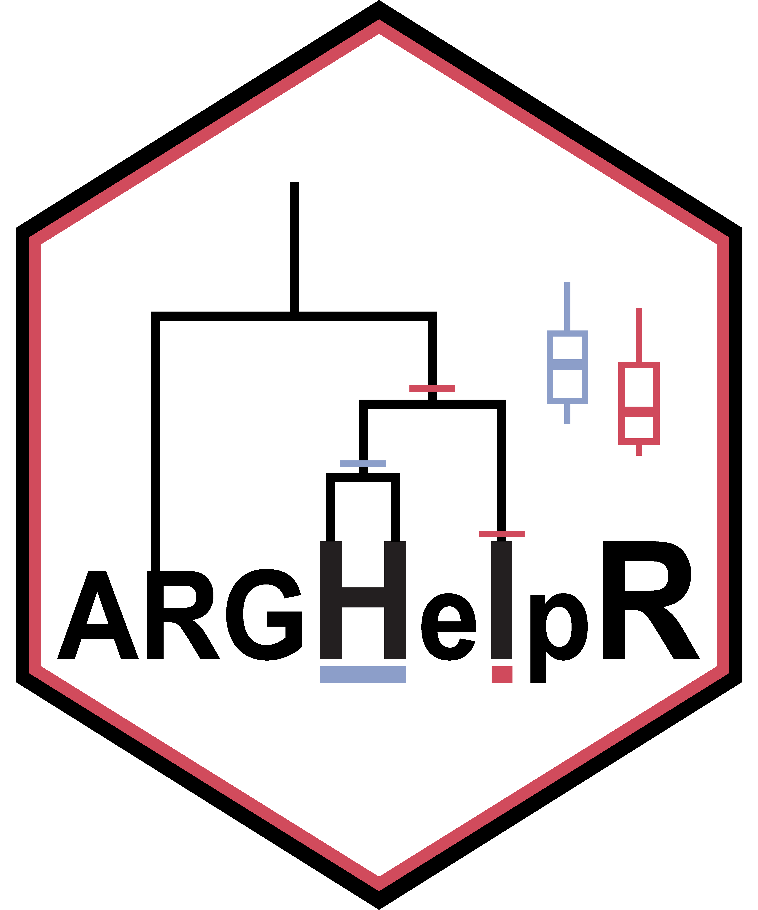

# ARGHelpR version 1.0.0 

**WARNING!** This website is currently in development. Links may or may
not work, please email Keaka Farleigh (<keakafarleigh@gmail.com>) if you
have any questions.

## What is *ARGHelpR*?

*ARGHelpR* is an R package that summarizes and visualizes ancestral
recombination graphs (ARGs). *ARGHelpR* allows researchers to identify
specific regions of the genome that may be influenced by some form of
selection and those that may be involved in specific processes such as
introgression. Please see our
[vignette](https://kfarleigh.github.io/placeholder) and
[tutorials](https://kfarleigh.github.io/placeholder) using the articles
dropdown tag to see how you can identify these regions in your own data
and how you can convert your output from different ARG programs into the
format needed to use *ARGHelpR*.

We plan to continue developing the package to include more functions,
feel free to reach out to Keaka Farleigh if you have any suggestions or
would like to collaborate.

## Installation

You can install the development version of ARGHelpR from
[GitHub](https://github.com/) with:

``` r

# install.packages("pak")
pak::pak("kfarleigh/ARGHelpR")
```

## Citing *ARGHelpR*
