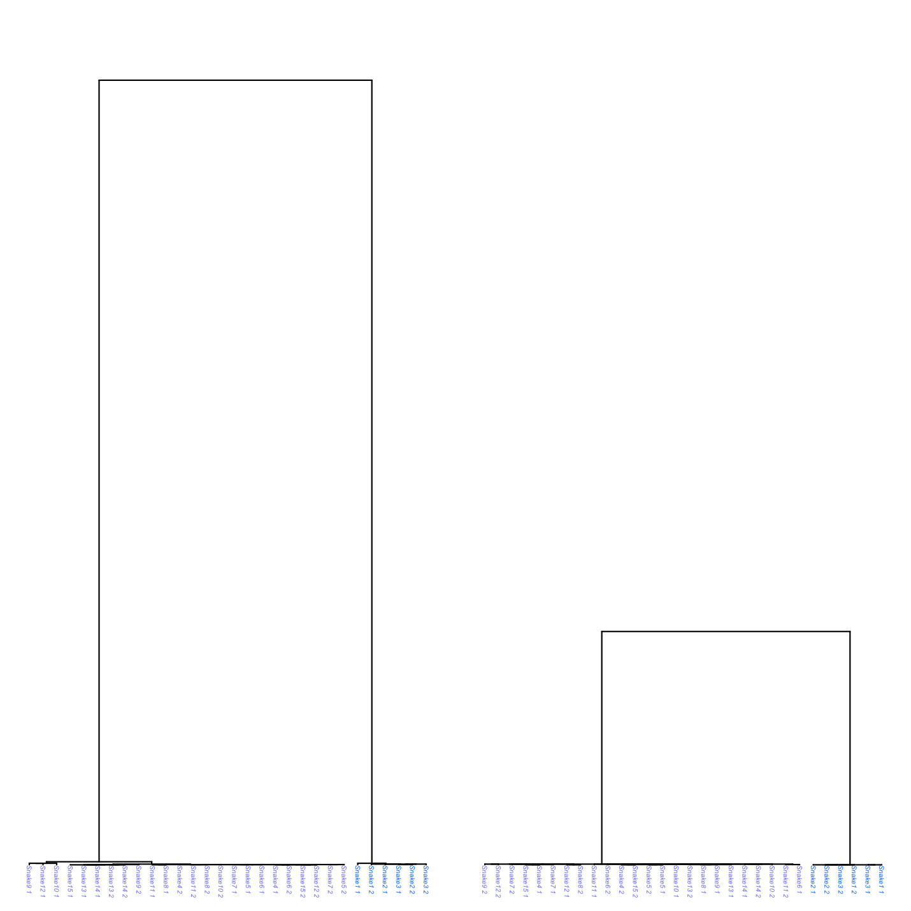
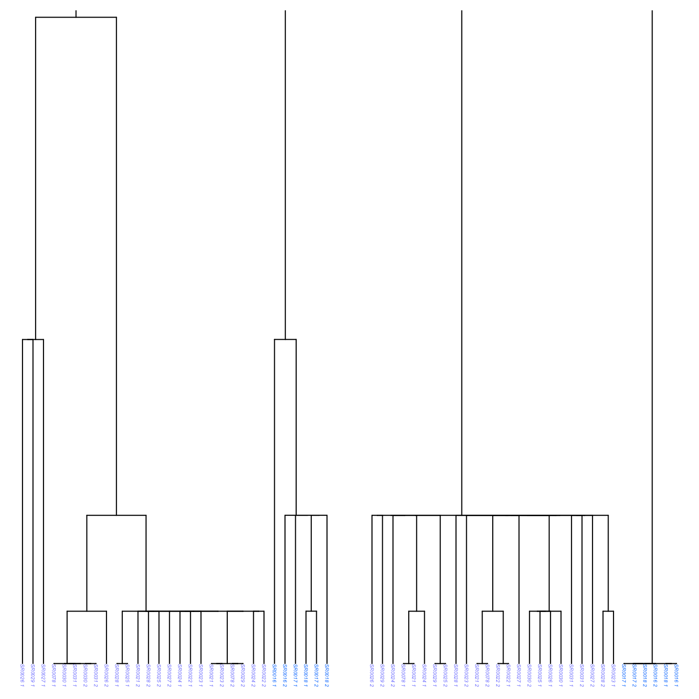

```{r, include = FALSE}
knitr::opts_chunk$set(
  collapse = TRUE,
  comment = "#>"
)
```

Written by: Keaka Farleigh, Ph.D.  
Date: September, 22nd, 2026.  
Date last modified: September, 22nd, 2026

## Purpose

To show you how to use ARGHelpR to summarize ancestral recombination graphs (ARGs), identify ARGs that may be indicative of selection influencing a particular region, identify ARGs that may shown signs of introgression, and visualize these results.

**Note we infer ARGs that represent regions influenced by selection and those that represent introgressed regions. This is only for the purposes of showing you how ARGHelpR works. You must understand you study system and determien which of these analyses are appropriate. For example, is there support for introgression or divergence? Please email Keaka Farleigh if you have any questions**.

Please see the [What's an ARG article](https://kfarleigh.github.io/ARGHelpR/articles/ARGHelpR_arg_background.html) if you would like some background on ARGs.

This vignette will proceed in five steps:

1. Inspect data and prepare it for analysis
2. Calculate ARG statistics
3. Identify divergence candidates
4. Identify introgression and balancing selection candidates
5. Visualize ARGs

### 1. Inspect data

ARGHelpR expects data to be a list where each element is a data frame containing information for a particular ARG; the first column is named chromosome and indicates the chromosome, the second column is named start indicates the start position of an ARG, the third position is named end indicates the end position of the ARG, and the fourth column is named tree and indicates the ARG itself. This is best represented as a bed file. You can find example scripts to convert your ARG output to a bed file in the format expected by ARGHelpR in the [formatting data article](https://kfarleigh.github.io/ARGHelpR/articles/ARGHelpR_formatting.html).

After we have a bed file, we can read it into R.

```{r Inspect data, echo = TRUE, eval = FALSE}

# Assuming a bed file with columns named chromosome, start, end, and tree
data <- read.delim("my_argdata.bed", header = TRUE)

# Split each row into a list element
data_list <- split(rattlesnake_args, seq_len(nrow(rattlesnake_args)))
```

Let's look at the data already in ARGHelpR. We see that the ARG data (`rattlesnake_args`) is a list with many elements and that we also have a population assignment file (`rattlesnake_pops`). The `rattlesnake_pops` contains population assignment data for each haplotype in your data. This is why there are `_1` and `_2` appended to the individual names in our data. 

```{r Inspect data2, echo = TRUE, eval = TRUE}
### Load ARGHelpR
library(ARGHelpR)

data("rattlesnake_args")

str(rattlesnake_args, list.len = 3)

data("rattlesnake_pops")

str(rattlesnake_pops)

```

Now that we have looked at our data we can calculate some statistics. 

### 2. Calculate ARG statistics

We calculate ARG statistics using the `argstats` function. This calculates various statistics, which are explained in the [understanding ARG stats article](https://kfarleigh.github.io/ARGHelpR/articles/ARGHelpR_statistics.html). The function requires are ARG data (`rattlesnake_args`) and population assignment information `rattlesnake_pops`. We also supply the names of each population to help us interpret the output. Users can also supply the number of cores to use `n.cores` argument to parallelize the calculations. While our dataset is small, whole genome data can be very large and parallelization is the only way to make compute time reasonable. You can also specify the `n.haps` argument, which influences how ARGHelpR calculates the time to the most recent common ancestor within (TMRCA~W~) statistic. `n.cores` and `n.haps` are optional. 

```{r argstats}
# Separate by population, this makes the function command easier. 
pop2 <- rattlesnake_pops[which(rattlesnake_pops$species == "pop2"),]
pop1 <- rattlesnake_pops[which(rattlesnake_pops$species == "pop1"),]

# Run the analysis, single core takes about 3 minutes on a machine with 16 Gb of RAM
snake_argstats <- argstats(arg.dat = rattlesnake_args, pop1 = pop1$sample, pop2 = pop2$sample, pop1.name = "pop1", pop2.name = "pop2")

# Bind into a single data frame
snake_argstats_df <- do.call("rbind", snake_argstats)

# Inspect the statistics
head(snake_argstats_df)

```


Awesome, now we have our data as a data frame. We can use this as input into `identify_argcandidates_divergence` and `identify_argcandidates_shared` to identify evidence of selection and/or introgression.

### 3. Identify divergence candidates

We will use the `identify_argcandidates_divergence` to identify ARGs exhibitng patterns that we would expect under different forms of selection, you can read the [identifying selection and introgression article](https://kfarleigh.github.io/ARGHelpR/articles/ARGHelpR_identifyfuncs.html) to understand how each test works. Briefly, we will use patterns of the time to the most recent common ancestor between (TMRCA~B~) and time to the most recent common ancestor within (TMRCA~W~) populations/species to identify possible evidence of selection. 

ARGHelpR can identify candidates with or without a user-specified genomic background (`background` argument). If the `background` argument is supplied then the thresholds are set based on that, if it is left empty then ARGHelpR uses the supplied distributions to determine thresholds. Users can also specify their own thresholds using all of the different `threshold` arguments. 

```{r divergence}

divergence_cands <- identify_argcandidates_divergence(dat = snake_argstats_df, analysis = "all")

# Bind together into a data frame 

divergence_cands_df <- do.call("rbind", divergence_cands)

# Make a column telling us which scenario each ARG was identified as
divergence_cands_df$scenario <- rownames(divergence_cands_df)

divergence_cands_df$scenario <- sub("\\..*", "", divergence_cands_df$scenario)

# How many of each scenario do we have?
table(divergence_cands_df$scenario)
```

### 4. Identify introgression and balancing selection candidates

Now we will use the `identify_argcandidates_shared` function to identify signals of balancing selection and introgression. This works in the same way as `identify_argcandidates_divergence`.

```{r introgression}

intro_cands <- identify_argcandidates_shared(dat = snake_argstats_df, analysis = "all")

# Bind together into a data frame 

intro_cands_df <- do.call("rbind", intro_cands)

# Make a column telling us which scenario each ARG was identified as
intro_cands_df$scenario <- rownames(intro_cands_df)

intro_cands_df$scenario <- sub("\\..*", "", intro_cands_df$scenario)

# How many of each scenario do we have?
table(intro_cands_df$scenario)

```


### 5. Visualize ARGs

Finally, we will plot the ARGs to show the patterns that we are identifying. We will use the `argplot` function. This function requires an arg (newick string), list of individuals in each population (`pop1` and `pop2` arguments), and the color (`col` argument) you would like to assign to each individual. You can also supply a scale and font size if you wish (`scale` and `font.size` arguments). The scale argument is particularly useful when you want to plot multiple args together; we will plot a random ARG and a recurrent selection (RS) ARG to see how this is useful.

```{r plot args, eval=FALSE}

# Select an ARG to plot
arg_toplot <- snake_argstats_df[8,19]

single_plot <- argplot(arg_toplot, pop1 = pop1$sample, pop2 = pop2$sample, col = c('#7D83FF', '#007FFF'), font.size = 0.75)

# We can change the scale to
single_plot_scale <- argplot(arg_toplot, pop1 = pop1$sample, pop2 = pop2$sample, col = c('#7D83FF', '#007FFF'), scale = c(0,275000), font.size = 0.75)
```

```{r arg plot, out.width= "400px", out.height= "400px", echo=FALSE, eval=TRUE, fig.align='center'}
knitr::include_graphics("single_argplot.png")
```


```{r multipanel plot, eval=FALSE}
# Let's plot a couple of ARGs together
par(mfrow = c(1, 2), mar = c(0.5, 0.5, 0.5, 0.5))

arg_toplot1 <- snake_argstats_df[8,19]

arg_toplot2 <- divergence_cands_df[91,19]

plot1 <- argplot(arg_toplot1, pop1 = pop1$sample, pop2 = pop2$sample, col = c('#7D83FF', '#007FFF'), scale = c(0,275000), font.size = 0.3)

rs_plot <- argplot(arg_toplot2, pop1 = pop1$sample, pop2 = pop2$sample, col = c('#7D83FF', '#007FFF'), scale = c(0,275000), font.size = 0.3)

```

```{r multipanel arg plot, out.width= "400px", out.height= "400px", echo=FALSE, eval=TRUE, fig.align='center'}

```

We see that the recurrent selection ARG does indeed exhibit a reduced TMRCA~B~, which matches our expectations. What about the tips? The TMRCA~W~ is also supposed to be reduced in one or both populations in a scenario of recurrent selection. We can focus on the ARG tips, by adjusting the scale. 

```{r multipanel tip plot, eval=FALSE}
# Let's plot a couple of ARGs together
par(mfrow = c(1, 2), mar = c(0.5, 0.5, 0.5, 0.5))

arg_toplot1 <- snake_argstats_df[8,19]

arg_toplot2 <- divergence_cands_df[91,19]

plot1_tips <- argplot(arg_toplot1, pop1 = pop1$sample, pop2 = pop2$sample, col = c('#7D83FF', '#007FFF'), scale = c(0,1000), font.size = 0.3)

rs_plot_tips <- argplot(arg_toplot2, pop1 = pop1$sample, pop2 = pop2$sample, col = c('#7D83FF', '#007FFF'), scale = c(0,1000), font.size = 0.3)

```

```{r multipanel arg tips, out.width= "400px", out.height= "400px", echo=FALSE, eval=TRUE, fig.align='center'}

```

We see that the TMRCA~W~ is also reduced relative to the background, thus confirming that the recurrent selection ARG matches our expected patterns of TMRCA~B~ and TMRCA~W~.


Thank you for your interest in ARGHelpR, please contact Keaka Farleigh if you have any questions or suggestions. 
